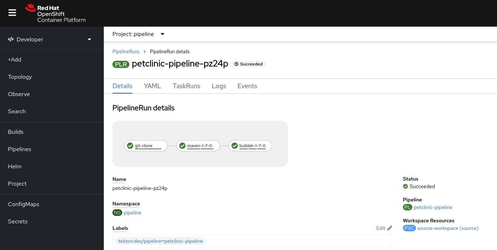

# Piplines with Private Repositories

This is a simple OpenShift Pipelines (Tekton) example that demonstrates how to integrate private repositories (both git and image registry) into a pipeline.

The simple flow is:
1. Clone source from a private GitHub repository.
2. Build the application (with Maven in this case).
3. Use Buildah to create a new container image and push it to a private registry (quay.io).



The key to integrating private repos and registries is `Secret`s and `ServiceAccount`s.

To supply git credentials to your pipeline, you create a `Secret` like the following:

```
apiVersion: v1
kind: Secret
metadata:
  annotations:
    tekton.dev/git-0: https://github.com
  name: git-auth
type: kubernetes.io/basic-auth
stringData:
  password: yourGitPassword
  username: yourGitUsername
```

One thing to notice is the annotation that describes the git server (in this case, https://github.com) that the credentials apply to.

For a private image registry, it is a similar situation.  The `Secret` would look something like:

```
apiVersion: v1
kind: Secret
metadata:
  annotations:
    tekton.dev/docker-0: https://quay.io
  name: quay-auth
type: kubernetes.io/basic-auth
stringData:
  username: yourRegistryUsername
  password: yourRegistryPassword
  email: yourEmailAddress
```

Instead of `git-0`, the annotation this time is `docker-0` and you define the registry server you will apply the credentials to (in this case, https://quay.io).

Finally, you have to link these secrets to the `ServiceAccount` that runs your pipelines.  The OpenShift Pipelines operator will automatically create a service account called `pipeline` in each of your namespaces.

You can still use a "GitOps" approach to linking your secret, simply by defining your "pipeline" service account in yaml you can easily list the secrets that it has access to.

```
apiVersion: v1
kind: ServiceAccount
metadata:
  name: pipeline
imagePullSecrets:
- name: quay-auth
secrets:
- name: git-auth
- name: quay-auth
```

That's it!  Now your pipelines will use the credentials you have defined in these secrets when cloning your code or pushing new images to your external registry.
